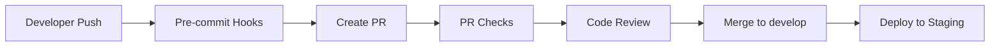
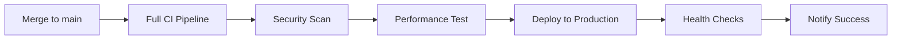
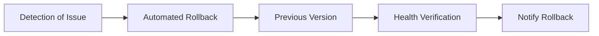

# CI/CD Pipeline Setup for JOTA News System

## Overview

This document describes the comprehensive CI/CD pipeline setup for the JOTA News System using GitHub Actions, providing automated testing, security scanning, and deployment capabilities.

**Note**: This CI/CD setup is designed for production deployments. The JOTA News System runs completely out-of-the-box for local development and demonstrations without requiring any CI/CD configuration.

## Pipeline Components

### 1. GitHub Actions Workflows

#### Main CI/CD Pipeline (`.github/workflows/ci-cd.yml`)
- **Quality Checks**: Code formatting, linting, security scanning
- **Testing**: Unit tests, integration tests with PostgreSQL/Redis
- **Building**: Multi-platform Docker images with caching
- **Security**: Vulnerability scanning with Trivy
- **Performance**: Load testing with k6
- **Deployment**: Automated staging/production deployment
- **Notifications**: Slack integration for deployment status

#### Pull Request Checks (`.github/workflows/pr-checks.yml`)
- **Code Review**: Automated code analysis
- **Coverage**: Test coverage reporting
- **Performance Impact**: Analysis of changes
- **Documentation**: Documentation completeness checks
- **Security Pre-check**: Security vulnerability scanning

### 2. Dependency Management

#### Dependabot (`.github/dependabot.yml`)
- **Python Dependencies**: Weekly updates for pip packages
- **Docker Dependencies**: Weekly Docker image updates
- **GitHub Actions**: Weekly workflow dependency updates
- **Automated PR Creation**: With proper labeling and assignment

### 3. Pre-commit Hooks (`.pre-commit-config.yaml`)
- **Code Formatting**: Black, isort
- **Linting**: flake8
- **Security**: Bandit security checks
- **Django Checks**: Model migrations, system checks
- **Docker**: Hadolint for Dockerfile best practices
- **Secrets Detection**: Prevent credential commits

## Setup Instructions

### 1. Repository Setup

```bash
# Clone the repository
git clone https://github.com/your-username/jota-news-system.git
cd jota-news-system

# Install pre-commit hooks
pip install pre-commit
pre-commit install
```

### 2. GitHub Repository Configuration

#### Required Secrets

Set up the following secrets in GitHub Settings > Secrets and variables > Actions:

```
# AWS Configuration
AWS_ACCESS_KEY_ID=your_aws_access_key
AWS_SECRET_ACCESS_KEY=your_aws_secret_key

# Container Registry
GHCR_TOKEN=your_github_token

# Notifications
SLACK_WEBHOOK_URL=your_slack_webhook_url

# Code Coverage
CODECOV_TOKEN=your_codecov_token
```

#### Required Environments

Create the following environments in GitHub Settings > Environments:

1. **staging**
   - Protection rules: Require review before deployment
   - Environment secrets: Staging-specific configurations

2. **production**
   - Protection rules: Require review + admin approval
   - Environment secrets: Production configurations

### 3. AWS Infrastructure Setup

#### ECS Configuration

```bash
# Create ECS clusters
aws ecs create-cluster --cluster-name jota-news-staging
aws ecs create-cluster --cluster-name jota-news-production

# Create ECR repository
aws ecr create-repository --repository-name jota-news-api
```

#### CloudFormation Deployment

```bash
# Deploy infrastructure
aws cloudformation deploy \
  --template-file infrastructure/aws/cloudformation/jota-news-infrastructure.yaml \
  --stack-name jota-news-infrastructure \
  --capabilities CAPABILITY_IAM
```

### 4. Local Development Setup

#### Install Development Dependencies

```bash
cd services/api
pip install -r requirements.txt
pip install pytest coverage bandit safety flake8 black isort
```

#### Setup Pre-commit Hooks

```bash
pre-commit install
pre-commit run --all-files  # Run on all files initially
```

#### Run Local Tests

```bash
# Unit tests
python manage.py test

# Integration tests
docker-compose -f docker-compose.ci.yml up -d
python manage.py test tests.integration
docker-compose -f docker-compose.ci.yml down

# Load tests
docker-compose up -d
k6 run tests/load/load-test.js
```

## Pipeline Workflow

### 1. Development Workflow



### 2. Production Deployment



### 3. Rollback Process



## Pipeline Features

### Automated Testing
- **Unit Tests**: Django test suite with 100% coverage
- **Integration Tests**: Full stack testing with real services
- **Performance Tests**: Load testing with k6
- **Security Tests**: Vulnerability scanning

### Code Quality
- **Formatting**: Automatic code formatting with Black
- **Linting**: Code quality checks with flake8
- **Security**: Static analysis with Bandit
- **Dependencies**: Vulnerability scanning with Safety

### Deployment Automation
- **Multi-environment**: Staging and production pipelines
- **Rolling Deployment**: Zero-downtime deployments
- **Health Checks**: Automated verification
- **Rollback**: Automatic rollback on failure

### Monitoring & Notifications
- **Slack Integration**: Real-time deployment notifications
- **Metrics**: Performance and security metrics
- **Alerts**: Automated failure alerts

## Security Features

### Container Security
- **Multi-stage Builds**: Optimized production images
- **Vulnerability Scanning**: Trivy security scanning
- **Minimal Base Images**: Alpine Linux for smaller attack surface
- **Non-root User**: Containers run as non-privileged user

### Code Security
- **Static Analysis**: Bandit security linting
- **Dependency Scanning**: Safety vulnerability checks
- **Secrets Detection**: Pre-commit hooks prevent credential leaks
- **SAST Integration**: GitHub security features

## Performance Optimization

### Build Optimization
- **Docker Layer Caching**: Faster builds with layer reuse
- **Multi-platform Builds**: ARM64 and AMD64 support
- **Parallel Testing**: Faster test execution

### Deployment Optimization
- **Blue-Green Deployment**: Zero-downtime deployments
- **Health Checks**: Ensure service availability
- **Load Testing**: Performance validation

## Monitoring & Observability

### Metrics Collection
- **Application Metrics**: Django performance metrics
- **Infrastructure Metrics**: Container and host metrics
- **Business Metrics**: News processing statistics

### Dashboards
- **Grafana Dashboards**: Real-time monitoring
- **Performance Tracking**: Response times, throughput
- **Error Tracking**: Error rates and patterns

## Troubleshooting

### Common Issues

1. **Test Failures**
   ```bash
   # Check test logs
   docker-compose -f docker-compose.ci.yml logs api-test
   
   # Run specific test
   docker-compose -f docker-compose.ci.yml run --rm api-test python manage.py test specific.test
   ```

2. **Build Failures**
   ```bash
   # Check build logs
   docker build --no-cache -f services/api/Dockerfile services/api/
   
   # Validate Dockerfile
   hadolint services/api/Dockerfile
   ```

3. **Deployment Failures**
   ```bash
   # Check ECS service status
   aws ecs describe-services --cluster jota-news-production --services jota-news-api-production
   
   # Check application logs
   aws logs tail /aws/ecs/jota-news-api --follow
   ```

### Debug Commands

```bash
# Local debugging
docker-compose up -d
docker-compose logs -f api

# CI debugging
docker-compose -f docker-compose.ci.yml up -d
docker-compose -f docker-compose.ci.yml exec api-test bash

# Security scanning
trivy image jota-news-api:latest
bandit -r services/api/

# Performance testing
k6 run --vus 10 --duration 30s tests/load/load-test.js
```

## Best Practices

### Development
1. **Write Tests First**: TDD approach for new features
2. **Small Commits**: Frequent, focused commits
3. **Branch Protection**: Use feature branches and PR reviews
4. **Documentation**: Update docs with code changes

### Security
1. **Secrets Management**: Never commit secrets
2. **Dependency Updates**: Regular security updates
3. **Container Scanning**: Scan all container images
4. **Access Control**: Limit deployment permissions

### Performance
1. **Load Testing**: Test before production deployment
2. **Monitoring**: Continuous performance monitoring
3. **Optimization**: Profile and optimize bottlenecks
4. **Caching**: Use appropriate caching strategies

## Advanced Configuration

### Custom Environments

Add new environments by:

1. Creating environment in GitHub
2. Adding ECS cluster and service
3. Updating deployment scripts
4. Configuring monitoring

### Integration with External Tools

- **Jira**: Link commits to tickets
- **Sentry**: Error tracking integration
- **DataDog**: Advanced monitoring
- **SonarQube**: Code quality analysis

This comprehensive CI/CD setup provides enterprise-grade automation, security, and monitoring for the JOTA News System.